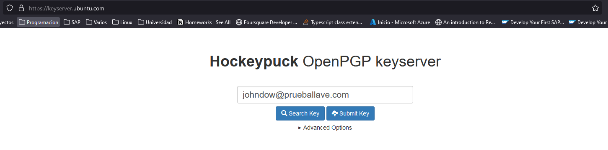
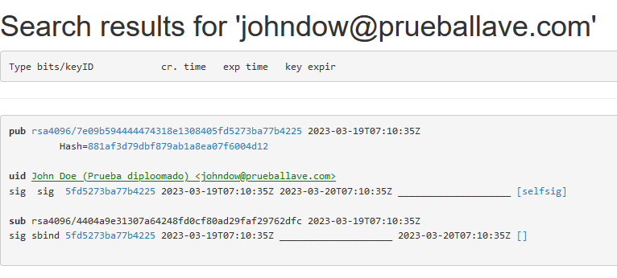

# GPG por linea de comandos
<p align="center">
    
</p>

GPG es un software, basado en el estándar RFC4880, que firma y cifrado de código abierto, que está inspirado en PGP, se puede considerar como la alternativa OpenSource. Como lo mencionan en la página oficial de GPG:

> GnuPG is a complete and free implementation of the OpenPGP standard as defined by RFC4880 (also known as PGP). GnuPG allows you to encrypt and sign your data and communications; it features a versatile key management system, along with access modules for all kinds of public key directories. GnuPG, also known as GPG, is a command line tool with features for easy integration with other applications. A wealth of frontend applications and libraries are available. GnuPG also provides support for S/MIME and Secure Shell (ssh). 

Existen diversos comandos que permiten realizar una gran diversidad de tareas relacionadas con el cifrado, firma y distribución de llaves.
El uso por consola de comandos varía dependiendo de las condiciones de cada sistema operativo, pero la esencia se mantiene, ya que es un software multiplataforma.

---

## Tabla de contenido
1. [Instalación de GPG](#instalación-de-gpg)
    - Ubuntu/Debian
    - Fedora/RHEL
    - CentOS
    - MacOS
    - Windows
2. [Comandos básicos](#comandos-básicos)
    - gpg --help
    - gpg --version
    - gpg --gen-key
    - gpg --import <archivo>
    - gpg --export --armor \<id de clave\>
    - gpg --encrypt --recipient <id de clave> <archivo>
    - gpg --decrypt \<archivo\>
    - gpg --sign \<archivo\>
    - gpg --verify \<archivo\>
    - gpg --list-keys
    - gpg --list-secret-keys
3. [Caso de uso](#caso-de-uso)
    - Listar las llaves
    - Generar llaves
    - Encriptar archivos
    - Subir o compartir llaves
    - Decodificar archivos
---

## Instalación de GPG
La instalación de GPG puede variar dependiendo del sistema operativo o distribución que se esté utilizando. A continuación se listan algunas instrucciones generales para los sistemas operativos más comunes:

- **Ubuntu/Debian**: Para instalar GPG en Ubuntu o Debian, se debe abrir una terminal y ejecutar el siguiente comando:

    ```bash
    sudo apt-get install gnupg
    ```

- **Fedora/RHEL**: En Fedora o Red Hat Enterprise Linux (RHEL), se puede instalar GPG con el siguiente comando:

    ```bash
    sudo dnf install gnupg
    ```

- **CentOS**: En CentOS, se puede instalar GPG con el siguiente comando:

    ```bash
    sudo yum install gnupg2
    ```

- **MacOS**: Si se está usando macOS, puede instalar GPG a través de Homebrew. Primero, se instala Homebrew siguiendo las instrucciones en [https://brew.sh/](https://brew.sh/). Luego, se abre una terminal y ejecuta el siguiente comando:

    ```shell
    brew install gnupg
    ```

- **Windows**: En Windows, se puede instalar GPG usando Gpg4win. Se puede descargar la última versión de Gpg4win desde [https://gpg4win.org/](https://gpg4win.org/) y seguir las instrucciones de instalación.

---

## Comandos básicos
GPG posee una gran variedad de argumentos que permiten realizar diversas operaciones. A continuación se describen los comandos más usados de GPG.  

Cabe aclarar que el uso de GPG se sustenta bajo la siguiente estructura:
```bash
gpg [options] [files]
```

- **gpg --help**  
    Despliega toda la información acerca de los principales parámetros posibles para utilizar. Además de la versión y los algoritmos soportados.
- **gpg --version**  
    Muestra la versión utilizada de GPG, sus algoritmos, y dependencias.
- **gpg --gen-key**  
    Genera un nuevo par de claves pública/privada
- **gpg --import <archivo>**  
    Importa una clave pública o privada desde un archivo
- **gpg --export --armor \<id de clave\>**  
    Exporta la clave pública especificada en - formato ASCII-armored
- **gpg --encrypt --recipient <id de clave> <archivo>**  
    Encripta un archivo con la clave pública especificada
- **gpg --decrypt \<archivo\>**  
    Desencripta un archivo
- **gpg --sign \<archivo\>**  
    Firma un archivo con la clave privada del usuario
- **gpg --verify \<archivo\>**  
    Verifica la firma de un archivo
- **gpg --list-keys**  
    lista las claves públicas del usuario
- **gpg --list-secret-keys**  
    Lista las claves privadas del usuario

Para mayor información acerca de todo el universo de comandos, puede consultar la documentación completa en la página oficial del proyecto GnuPG: [https://gnupg.org/documentation/index.html](https://gnupg.org/documentation/index.html).

---

## Caso de uso
El uso de llaves asimétricas permite dar un paso más haya en la seguridad al momento de transferir información a través de internet. Es por esto que en este ejemplo/caso de utilización, se va a ejecutar el ejercicio de encriptar un archivo, compartir la llave pública, y decodificar el archivo a partir de la misma.

1. Se listan las llaves con el comando
    ```bash
    gpg --list-keys
    ```
    Inicialmente, si no se tienen llaves agregadas, el resultado va a ser vació.
2. Se genera una par de llaves con el comando
    ```bash
    gpg --full-gen-key
    ```
    Al ejecutar el comando, se inician una serie de preguntas que parametrizan la creación de las llaves.

    1. Qué tipo de llave se quiere crear:
        ```bash
        gpg (GnuPG) 2.2.27; Copyright (C) 2021 Free Software Foundation, Inc.
        This is free software: you are free to change and redistribute it.
        There is NO WARRANTY, to the extent permitted by law.

        Please select what kind of key you want:
        (1) RSA and RSA (default)
        (2) DSA and Elgamal
        (3) DSA (sign only)
        (4) RSA (sign only)
        (14) Existing key from card
        Your selection? 1
        ```
        En este caso se va a usar el algoritmo por defecto **`RSA`**.
    2. Cuál va a ser la longitud en bits de las llaves:
        ```bash
        RSA keys may be between 1024 and 4096 bits long.
        What keysize do you want? (3072) 4096
        Requested keysize is 4096 bits
        ```
        En este caso se va a digitar **`4096`**.
    3. Cuál va a ser el tiempo de expiración de las llaves:
        ```bash
        Please specify how long the key should be valid.
               0 = key does not expire
            <n>  = key expires in n days
            <n>w = key expires in n weeks
            <n>m = key expires in n months
            <n>y = key expires in n years
        Key is valid for? (0) 1
        ```
        En este caso se va a digitar **``1``** que hace referencia a un día como de duración de las llaves antes de que expiren. En caso de que sea una semana sería **`1w`**, etc.
    4. Confirmar la fecha:
        ```bash
        Key expires at Mon 20 Mar 2023 02:00:38 AM -05
        Is this correct? (y/N) y
        ```
        Luego de seleccionar el tiempo de expiración, se muestra la fecha en que expirarían las llaves. Además, pide confirmación.
    5. Generar la identidad del usuario
        ```bash
        GnuPG needs to construct a user ID to identify your key.

        Real name: John Doe
        Email address: johndow@prueballave.com
        Comment: Prueba diploomado
        You selected this USER-ID:
            "John Doe (Prueba diploomado) <johndow@prueballave.com>"

        Change (N)ame, (C)omment, (E)mail or (O)kay/(Q)uit? o
        ```
        De primera mano se digita la información respectiva al nombre, el correo electrónico y algún comentario. Luego se digita **`o`** para confirmar que todos los datos están OK.
    6. Digitar contraseña
        ```bash
        ┌──────────────────────────────────────────────────────┐
        │ Please enter the passphrase to                       │
        │ protect your new key                                 │
        │                                                      │
        │ Passphrase: ________________________________________ │
        │                                                      │
        │       <OK>                              <Cancel>     │
        └──────────────────────────────────────────────────────┘
        ```
        Se digita la contraseña de las llaves y se presiona **`OK`**. Es importante recalcar que la contraseña no puede ser olvidada, ya que se perderá acceso a las llaves y a los archivos que hayan sido encriptados con dichas llaves.

        En caso de que se ingrese una contraseña poco segura, aparecerá la siguiente advertencia:
        ```bash
        ┌───────────────────────────────────────────────────────┐
        │ Warning: You have entered an insecure passphrase.     │
        │                                                       │
        │ A passphrase should be at least 8 characters long.    │
        │                                                       │
        │ <Take this one anyway>         <Enter new passphrase> │
        └───────────────────────────────────────────────────────┘
        ```
        Donde se decide cambiarla o dejar la misma.
    7. Generar entropía
        ```bash
        We need to generate a lot of random bytes. It is a good idea to perform
        some other action (type on the keyboard, move the mouse, utilize the
        disks) during the prime generation; this gives the random number
        generator a better chance to gain enough entropy.
        We need to generate a lot of random bytes. It is a good idea to perform
        some other action (type on the keyboard, move the mouse, utilize the
        disks) during the prime generation; this gives the random number
        generator a better chance to gain enough entropy.
        ```
        Se deben seguir las instrucciones dadas, tales como mover el mouse, presionar alguna tecla del teclado, etc. Esto con el fin de agregar una variable única a las llaves.
    
    Al completarse todos los pasos, se genera la llave. Se informa de donde se almacena, el hash, el algoritmo usado, la información del usuario y la fecha de expiración.
    ```bash
    gpg: key 5FD5273BA77B4225 marked as ultimately trusted
    gpg: directory '/home/ex/.gnupg/openpgp-revocs.d' created
    gpg: revocation certificate stored as '/home/ex/.gnupg/openpgp-revocs.d/7E09B594444474318E1308405FD5273BA77B4225.rev'
    public and secret key created and signed.

    pub   rsa4096 2023-03-19 [SC] [expires: 2023-03-20]
        7E09B594444474318E1308405FD5273BA77B4225
    uid                      John Doe (Prueba diploomado) <johndow@prueballave.com>
    sub   rsa4096 2023-03-19 [E] [expires: 2023-03-20]
    ```
3. Se listan, de nuevo, las llaves con el comando
    ```bash
    gpg --list-keys
    ```
    Ahora, en este caso, luego de haber creado la llave, aparecerá listada:
    ```bash
    gpg: checking the trustdb
    gpg: marginals needed: 3  completes needed: 1  trust model: pgp
    gpg: depth: 0  valid:   1  signed:   0  trust: 0-, 0q, 0n, 0m, 0f, 1u
    gpg: next trustdb check due at 2023-03-20
    /home/ex/.gnupg/pubring.kbx
    ---------------------------
    pub   rsa4096 2023-03-19 [SC] [expires: 2023-03-20]
        7E09B594444474318E1308405FD5273BA77B4225
    uid           [ultimate] John Doe (Prueba diploomado) <johndow@prueballave.com>
    sub   rsa4096 2023-03-19 [E] [expires: 2023-03-20]
    ```
    La **fingerprint** generada es **`7E09B594444474318E1308405FD5273BA77B4225`**
4. Se debe validar la existencia del archivo, su correcto nombre y ruta para realizar la encriptarían. En este caso el comando para listar los archivos y carpetas es **`ls`**. De esta manera se pueden observar los archivos:
    ```bash
    ex@DESKTOP:~$ ls
    archivo_secreto.txt
    ```
    Para el ejemplo se usará **`archivo_secreto.txt`**
5. Se encripta un archivo a partir de la llave creada con el comando:
    ```bash
    gpg --ecrypt archivo_secreto.txt
    ```
    GPG pedirá un id para reconocer la llave con la que se desea encriptar el archivo. Se digita el correo:
    ```bash
    You did not specify a user ID. (you may use "-r")

    Current recipients:

    Enter the user ID.  End with an empty line: johndow@prueballave.com
    ```
    Posteriormente, GPG confirma la llave con la que se encriptara el archivo.
    ```bash
    Current recipients:
    rsa4096/0AD29FAF29762DFC 2023-03-19 "John Doe (Prueba diploomado) <johndow@prueballave.com>"
    ```
6. Una vez encriptado el archivo, se generará uno nuevo con el mismo nombre, pero con una extensión **`.gpg`**:
    ```bash
    ex@DESKTOP-UNC67M2:~$ ls
    archivo_secreto.txt  archivo_secreto.txt.gpg
    ```
    Si se trata de leer el contenido del archivo, este será ilegible de forma natural:
    ```bash
    cat archivo_secreto.txt.gpg
    �
    
    �z��F�Ւ��=�]SX��hb�S֯Ё��1w���o�E�9��zW�iO�s�ԗI�h2�_Á�0�;��zx        �zjE
                                            �Z�1����L���ř�Hx���W Ӱ��79"6
                                                                            �p��ݙM阂�[��p��9�^-
    �k/�T��ѫ�O��ps��&���3�                                                                   OI���p��q���!��A�<]�T�+"S�A��.�5=Q����٭]���                         ٵ������dr��c�VV��� ۞�s        1潠ս/H=x�zg��6�d     �y�N� <�O|�@�.�A�.��eľ�#�_���Wbi�9�~����?��GCe���"��+�:o�� a�@b��n����Yi9�eDޡU(J�O�"*�+� ���
                                            ��|j���E�[��k�Y-����
                                                                    �rL��zBx����t����=R�����(�YF����a3n
    v
    ���������U"�g5
    K�����-��B��G���GG����\���
    6AO�wR����}�b����k���U�ҊN�O�5[��r�F���٬�����h�S�)�j��        �0*��C_1Z�e��!#�Q��
    ```
7. *(Opcional)*  
Existen varias formas de compartir las llaves públicas. Las alternativas más comunes son a través de un servidor público de llaves pgp/gpg o mediante el envío de la llave pública de forma manual.
    - Servidor de llaves públicas  
    1. Se debe localizar algún servidor público  donde se quiera subir la llave. Hay varias alternativas como [https://keys.openpgp.org/](https://keys.openpgp.org/), [https://keyserver.pgp.com](https://keyserver.pgp.com), [https://keyserver.ubuntu.com](https://keyserver.ubuntu.com), etc.
    2. En este caso se hará uso del servidor público de Ubuntu.
    3. Para subir la llave al servidor se ejecuta el siguiente comando:
        ```bash
        gpg --keyserver hkp://keyserver.ubuntu.com --send-keys 7E09B594444474318E1308405FD5273BA77B4225
        ```
        En el cual se especifica el servidor, con el protocolo **`hkp`**, y el fingerprint de la llave.
        Si la subida es exitosa, se recibirá una respuesta del tipo
        ```bash
        gpg: sending key 5FD5273BA77B4225 to hkp://keyserver.ubuntu.com
        ```
    4. Para verificar si la llave fue cargada, se accede a la url del servidor

        
        
        Y se realiza la búsqueda por algún identificador de la llave, en este caso por el correo electrónico.
    5. El resultado de la búsqueda es la información de la llave relacionada, donde se puede ver todos los datos de la llave pública.

        

    6. Para descargar una llave, se usa el siguiente comando:  
        ```bash
        gpg --keyserver hkp://keyserver.ubuntu.com --recv 5fd5273ba77b4225
        ```
        Al cual se le especifica el servidor y el fingerprint. Esto arroja, por consola, lo siguiente:
        ```bash
        gpg: key 5FD5273BA77B4225: "John Doe (Prueba diploomado) <johndow@prueballave.com>" not changed
        gpg: Total number processed: 1
        gpg:              unchanged: 1
        ```
        Lo que significa que la llave fue descargada exitosamente.

    - Exportar/importar llave pública
    1. Se debe ejecutar el siguiente comando:
        ```bash
        gpg --armor --export johndow@prueballave.com
        ```
        El cual genera imprime por consola la llave pública:
        ```bash
        -----BEGIN PGP PUBLIC KEY BLOCK-----

        mQINBGQWtWsBEAC62L9KYUGwXi9Q2S5ZjRWUeN/oUrl4ybS1ts7c/b1KxbYTExQ4
        S/jEfJ8dXVW0E4pPtQi+rpG3eYDXfNTPhCMGxwbDvYsjNGzAgvDJmVPozCMibcXW
        aYT9FAEbEcPcSHNrJePxfw3wOy1Iz3rvp3yuSzNulNiHSWBU3J1DPrqGWVGEPZ8z
        qL2UV/fW0Ybdt/i+QKw05eqvS+Xi2abLTewsIKX30EnB2gL44l4QiL+Y9/nC8nIs
        F1J7c8JGYn/sKpHYGNOLSs5qzH7fmWAt42H//aZLnCLiLeCEYQHx0pw3cfPtvA0G
        wq7n7Xr4lK0X1IQ14ReN75UKERlkjaMhYcWe5+EVvXJBl8GB3VLBBAUpIqhHMprD
        Z2OlkiFDwEmq+mufvPbzBQW2W+b7lIRWovN5LzPJ/48ksHSSAJmRytUwTl4dStap
        /ZPqRJE05WQ0v0QLKt4gKzfIRsn1L2Ug5ZspKeMA2SQxh1q+khkB0CB0FlqSxBFW
        ce1WVWj2y6sD9BBE3QHIATd6gtRi4HOzM2JiR24Ia1oXGzOtgYv+7vnmDE7bN4ib
        x60XfPX6XJ0aKDVSaRp8gys5mQmTBpJYVj0iqcuY1UnI/AiYVIZByWhdXhjanUoK
        GCsE9s2OTurggHbVgxYGhPcZy+Id6nx9GhEIcgt4lbPIZduv2NNn8vdiewARAQAB
        tDZKb2huIERvZSAoUHJ1ZWJhIGRpcGxvb21hZG8pIDxqb2huZG93QHBydWViYWxs
        YXZlLmNvbT6JAlQEEwEKAD4WIQR+CbWURER0MY4TCEBf1Sc7p3tCJQUCZBa1awIb
        AwUJAAFRgAULCQgHAgYVCgkICwIEFgIDAQIeAQIXgAAKCRBf1Sc7p3tCJU47D/9l
        3LmjqUrw8A0BbSxxoYAlV6TojiSKoQL2Wbr4m4ENUroV7CQHdvvbf4A9d5XrPh9a
        fJn2LYBDxjV+0Aw9il9qvHx3PCzWWAAbKk8UyOKzvi+zPjLd09j/WZ+LX5KY52+o
        IS8zrr+3lTiaOuk4RM4ZtBxVViabsB39DDcBxk5Eoyy6X8Z6Q4r5ynFuNwX19gdy
        Aabb5bPtjQ50Ii65+PeevBg3o0nZEe11hvv2TZAAMoluj46WqMrlaXqmj8GU7Zkl
        Gp4V/Dku5NikqeKKIz6CXABKSC21ixOYv9Vt4DoJnLid/wF1UiDNtl1SfIvVHNym
        KRaL5ZefdqO16ppw2vCOCTF2z8OGgJI5RmiixnG+gD0jxwM1Ugssu0r8b9jzF9sg
        vwA2r+cAvtRMbTzykbQWdrWzjrJDYAD4G+bNw9Sovd4LH0YzOgOlSZf2ipd9X/nR
        Lp7D2PpwnErZ7Itol25DwVO8NsmV2qIAzUrYQJ8xLa0RwbORsHfiiIajUEw2ooio
        N0RSw1nNxwf9vo7D3M59ZkAFpTDy+ssXVZaScn7D6GdvIcT4RhWh/rUB6WikDRMM
        4m9/9OvaqIbkf43NtgKEBcApiRlw+ZoVp50QFtmyNDlGrvSmTdKuNav8oVd0lbRF
        XK1YLcMmW1ftnM08pPDuSCOdUSjv2e0suv6YT2XffbkCDQRkFrVrARAA1pmN2cv3
        wDDXHAIusERBCfbYprlonPWv4QM1+s5ouBCRNv94Kh17ZY0bMy9nlMQq5HH5/9uS
        zeaUf4Jn7Q9Tx5fxBFYorV0LSXkPXjRIFRlo2tkDZ2bQyiBGUPZl+lU7UzEM4byu
        6FZ1esrpDhaoUyAld0KJs3IQkjGZbihTFxu3GljcKSrCF/8bOSlUul9TJ1U39D28
        gS6Ut1Gj3PaRREgUZEGzkfjlVTDdaz+NyASdUwUfruNdssN2S+1xLUsE73i54hRF
        zaX0K1TYCakYy6tMmlXoZfKUtRZMQyeQsuRkpecPbUG8VDOox4oe+/TgvWsyu++c
        vExqUU7AXJqtrFahbMdC0e5mMC0Xydgnb73eojbNrIAtziN3HSC9F59kT4gTRVB8
        LsP9/mnV9Wa3w3dDfBqbq8Gkw8Wc2/DMSxjR7U9A1oCGoV364X2Td+RFakVCZtAF
        8nHZXVKDtsuHXiM0YxPztwb6xV/eHU8CReYUbshhsx4oQwwinM1R+r+O+MuTHEdJ
        j6oRWPmNEC2jjGUBgZhvOzu4JYI7iJ1fb8uoCru0AM6dqyKqZ61C9cIupkjEYY/b
        dh+vzYSiCDU1AehKVLeIazHaNQIEK1RTHefn6o2mSpiJXBGilU6RJccP4K1cp2hl
        eKH3mEloXBMXzC6VaVk9naQZf/JMAa3LTicAEQEAAYkCPAQYAQoAJhYhBH4JtZRE
        RHQxjhMIQF/VJzune0IlBQJkFrVrAhsMBQkAAVGAAAoJEF/VJzune0IlJUcP/jmG
        d3vVu19fuITCKib5eSQeSoKfdXuKo/ravXwtKw1naDyYJdfVvwblrSebJ9ue3M1q
        gmN6YEX0iJTtkTvKXBFdC4AA3/9KPTTLmtCvmw52oYaw7KWIOSDHGQ440/73i9ws
        wA9CdYsel6+PIflJkPEmv41kiEkL8fcGoopMSFbhl+Q1K/1rr/GlqwtRwqEhVWOM
        HevIWhaimDGriAynLwI1x6uKc4pysV9D4QLGKlUFsyfpF6T5THMbdWAivIrfnKYd
        Wzu9wHMVg+Rlf1ROnRW4nDIQv/3LJeyDjPu27LQLjmx3tQ2fHJnZxNMsq9ScQmZc
        wjAGsuetfI0XsXuI9nLrwXhPQ0ohYBfV6f6Xc59k6o47XbhUOf3shBijr9A4cvBk
        drGE4qySIwDlxGKyybPe+OpM0lJpqjF8AqtIZLlMy1d6IGx6krMB485AMN5MmS2f
        20jeZ46FoSi4pco1Gzglxrbb0jMAj8Laprie2WgbtqwFvf7sRMyHu3E+9r5kNW/O
        1wocKlg6tko4StpW8zX8zAoLtGwsxHV3OM9bw2Q0eUyqeyBQ0YZTc5mD/P+nBQv5
        JAERPxgZ9/N1e5Eo9NIXReDnguu/Zb5ApwKI/jlk547FyWcQ9csTPI1xC59IKanV
        LjnuWZDnXnhZTD3bRDjes3fPHUeEXYsRRjju8XTL
        =5iNW
        -----END PGP PUBLIC KEY BLOCK-----
        ```
        Para guardar la llave en un archivo, se debe ejecutar una modificación del comando anterior, de forma que:
        ```bash
        gpg --armor --export johndow@prueballave.com > llave.asc
        ```
        Lo que crea un archivo con el nombre llave.asc el cual contiene la llave pública y que se puede compartir por algún medio, ya sea correo electrónico, o mensajería instantánea.

    2. Para importar una llave pública descargar por algún medio, se debe ejecutar el siguiente comando:
        ```bash
        gpg --import llave.asc
        ```
        Se debe relacionar el nombre del archivo que contiene la llave pública.
        El comando dará como resultado lo siguiente:
        ```bash
        gpg: key 5FD5273BA77B4225: "John Doe (Prueba diploomado) <johndow@prueballave.com>" not changed
        gpg: Total number processed: 1
        gpg:              unchanged: 1
        ```
        Que denota que no hubo errores, por lo tanto, la llave ya estaría importada en la lista del computador.

8. Para decodificar un archivo .gpg, se hace uso de la llave privada. Este proceso funciona solamente si el archivo a decodificar fue encriptado con alguna llave pública de nuestra propiedad. El comando usado para decodificar es:
    ```bash
    gpg --decrypt archivo_secreto.txt.gpg
    ```
    Este comando arrojará por consola la información del proceso de encriptado y  el contenido del archivo
    ```bash
    gpg: encrypted with 4096-bit RSA key, ID 0AD29FAF29762DFC, created 2023-03-19
      "John Doe (Prueba diploomado) <johndow@prueballave.com>"
    Mensaje secreto :D
    ```
    En caso de que se quiera guardar el contenido en un archivo, se debe ejecutar el comando de la siguiente manera:
    ```bash
    gpg --decrypt archivo_secreto.txt.gpg > archivo_desencriptado.txt
    ```
    Esto creara un archivo con el nombre **`archivo_desencriptado.txt`** y su respectivo contenido.

    *Nota: Este comando solicita digitar la contraseña de las llaves para realizar la decodificación*

---

De esta manera se puede observar como se hace uso de gpg mediante la consola de comandos. El uso de la misma puede variar entre sistemas operativos y/o shells, pero la esencia es la misma, proteger al mundo.

<p align="center">
    
    
</p>