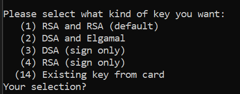
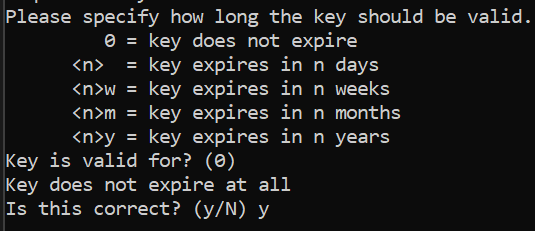

## Encriptación asimetrica con gpg

#### **Instalación**

```
sudo apt-get install gnupg
```

Para generar una llave, se necesita el siguiente comando:

```
gpg --full-gen-key
```

Este comando preguntara con que tipo de encriptación se quiere en quiere encriptar la llave:



Luego de esto preguntara cuantos bits de largo se quiere que sea la encriptación


Escogido eto, nos preguntara en cuanto tiempo se quiere que expire la llave para ya no ser valida



Después de haber confirmado la expiración, se debera construir un id a la llave con las caracteristicas de nombre, correo y comentario


Para poder observar las llaves que se han creado, se debe digitar el comando:

```
gpg --full-gen-key
```

Este comando arrojara las llaves que se han creado con su debido identificador, como se muestra en la siguiente imagen:


Para enviar la llave se utiliza el siguiente comando

```
 gpg --keyserver keys.openpgp.org --send-key
```

Donde se pudo evidenciar que al utilizar hkp el comando no funciona, investigando en diferentes webs, se encuentra que esto esta en desuso, por ello se quito esto para poder emitir la llave.

Siguiente de haber subido la llave a nuestro servidor, nos dirigimos a este y buscamos nuestra llave.


