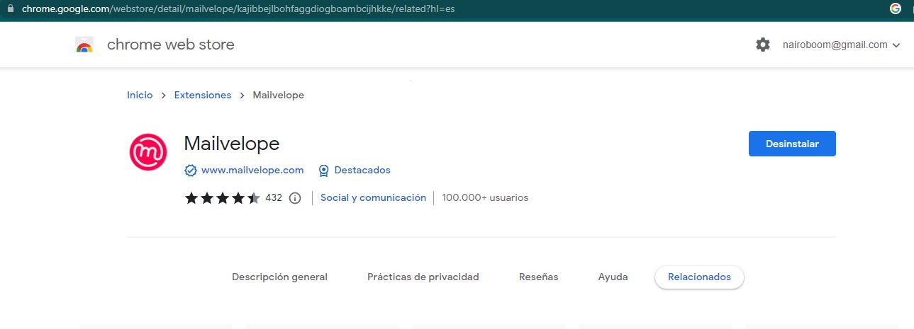
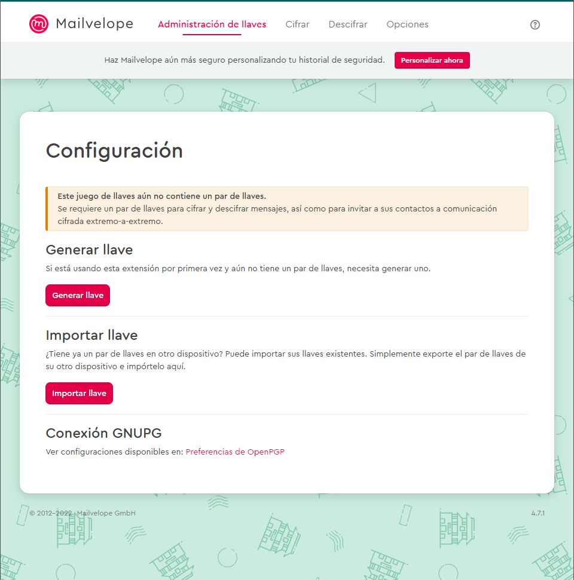
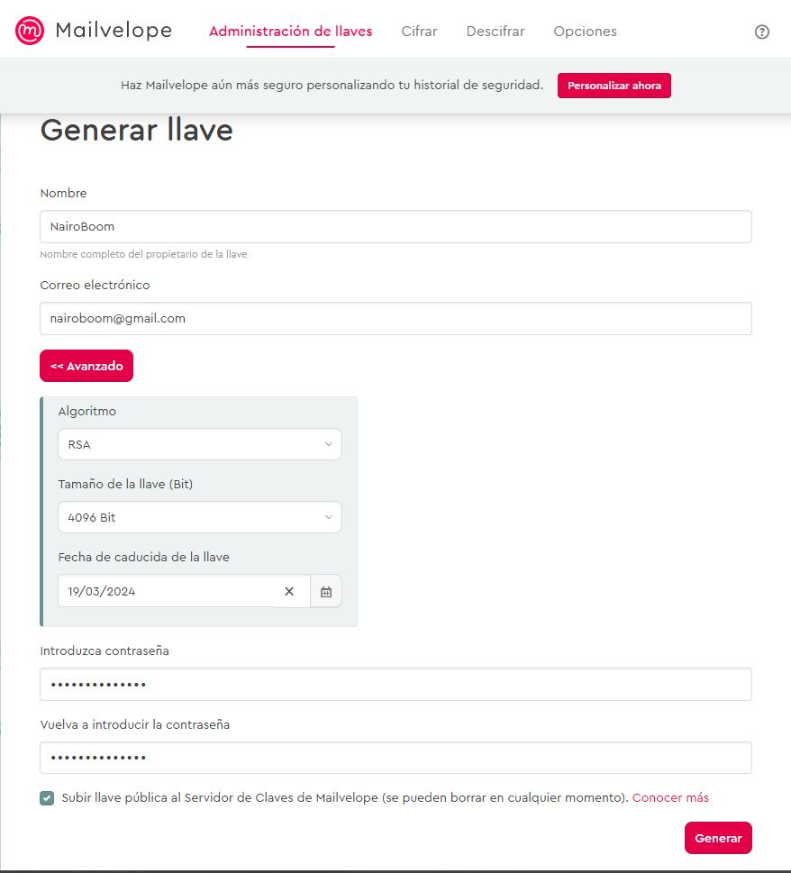
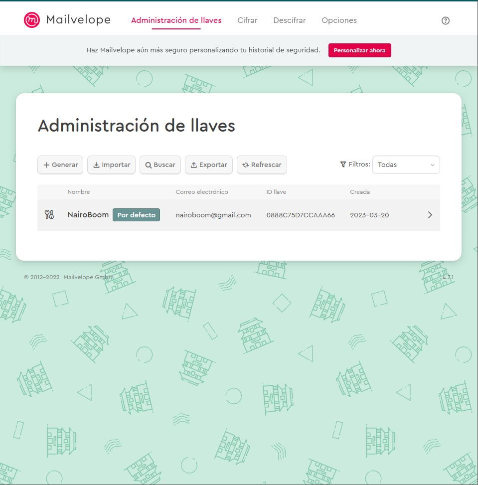

# El cifrado PGP en Gmail y la extensión Mailvelope para Firefox y Chrome

## ¿Qué es Mailvelope?

Es una extensión para los navegadores Google Chrome y Mozilla Firefox que es totalmente gratuita, incorpora el estándar OpenPGP para el cifrado y descifrado de texto en los correos electrónicos, pero es que además permite cifrar los archivos adjuntos de dichos e-mails. Su utilización es muy sencilla si antes has usado algún programa basado en PGP para enviar y recibir correos electrónicos, hoy en RedesZone os vamos a enseñar cómo se configura y cómo se envían los e-mails cifrados para que nadie los lea.

### Proceso de instalación en Google Chrome

1. Instala la extensión Mailvelope en tu navegador Google Chrome. Puedes descargarla desde la Chrome Web Store.

2. Al ingresar a la extensión, nos aparecera la página en donde configuraremos nuestra llave, en este ejemplo, realizaremos el proceso desde cero, por lo cual presionaremos el boton de "Generar llave".

3. Nos arrojará la siguiente visual, en la cual nos solicitará el correo y nombre de usuario, al presionar el boton de opciones avanzadas, nos pedirá el tipo de algoritmo, el tamaño de la llave y la fecha de caducidad de la llave, posteriormente, deberemos ingresar la contraseña que se le asignara a nuestra llave.

4. Al generar la llave, nos aparece en la administración de esta, tal cual como se muestra a continuación:

