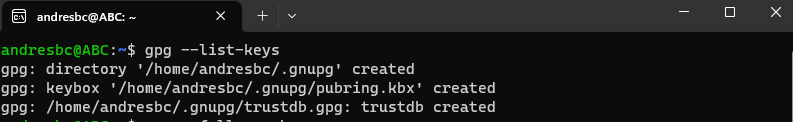
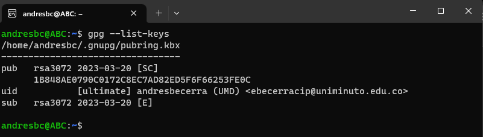
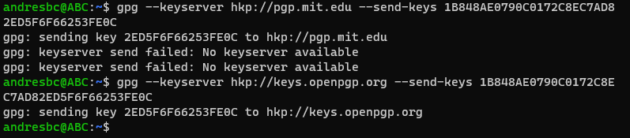
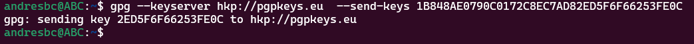
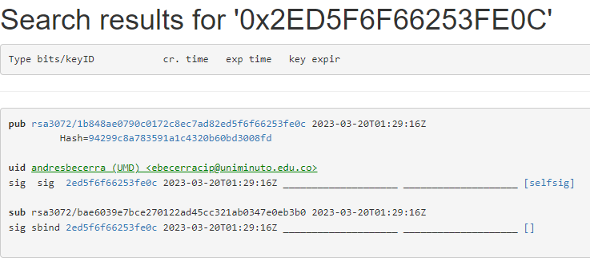
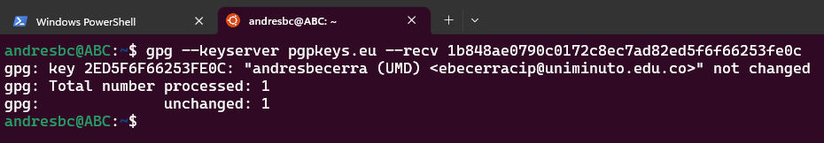
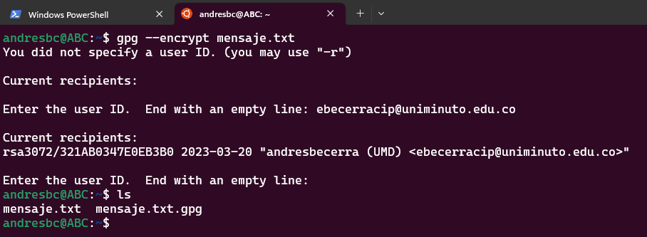
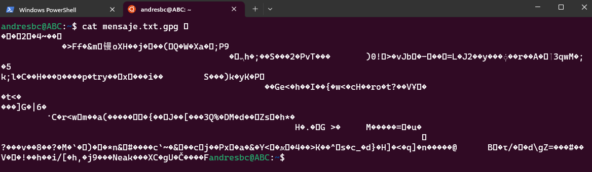
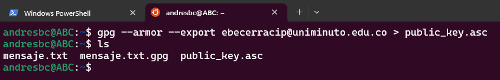

# GPG - Llave publica y privada digital

Es un derivado libre de PGP y su utilidad es la de cifrar y firmar digitalmente, siendo además multiplataforma aunque viene incorporado en algunos sistemas Linux, como en Ubuntu. GPG tiene un repositorio de claves (anillo de claves) donde guarda todas las que se tienen almacenadas en el sistema, ya sean privadas o públicas.

### Comandos de funcionamiento

- Verificación de llaves en el sistema

`$ gpg --list-keys`

- Generación de una llave nueva, elijiendo (RSA and RSA, cantidad de bits 3072 recomendado, 0 - para que nunca expire la llave) como por defecto e ingresando los datos correspondientes para la creación de un user ID de la llave (nombre, correo electronico y un comentario)

`$ gpg --full-gen-key`

- Una vez termina la creación de la llave, se ejecuta el mismo comando del inicio para la verificación

`$ gpg --list-key`

- Para exportar la llave generada, se ejecuta el siguiente comando, donde el hkp es la dirección url de server OpenPGP donde se va a guardar la llave y [XXX] es el ID correspondiente a la llave

`$ gpg --keyserver hkp://keyserver.pgp.com --send-keys `

- Sin embargo, el link de la BD que nos funcione es https://pgpkeys.eu/

- Se verifica en la url buscando que la llave se haya cargado exitosamente

- Posterior, debemos importar la llave publica con el keyId que nos arroja la BD donde fue cargada, donde es el ID correspondiente a la llave que genera la BD

`$ gpg --keyserver pgpkeys.eu --recv [XXX]`

- Creacíón de un archivo para encriptarlo, el archivo que se generar tendra la extencion .gpg

- Al intentar leer el mensaje con un editor, no sera posible

- Lo siguiente sera exportar la llave publica .asc y enviarla para que en destino sea posible su desencriptado y lectura de mensaje

- Por ultimo, para desencriptar el archivo con la llave publica, se debe ejecutar el siguiente comando, el cual generar el archivo con el mensaje que recibimos y a abrirlo con un editor podremos ver el mensaje

`$ gpg --decrypt mensaje.txt.gpg > archivo_desencriptado.txt`

** Paso a paso creado por usuario GITHUB: ebecerracip

